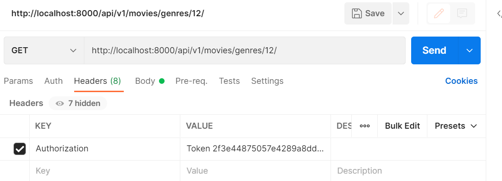

#### git branch 활용하기


**master** 

1. readme생성
2. add commit push 

```bash
git switch -c dev 

git branch

git switch -c (해당기능)
```

 push 시 dev에 병합 


---


npm install

---


### vue 시작하기 


```bash
npm install -g @vue/cli

vue --version
#@vue/cli 5.0.4
```


**프로젝트 생성 - vs코드로 진행** 

```bash
vue create final
```


**vue 버전 선택** 


**프로젝트 디렉토리 이동** 

```bas
cd final
```


**vue  router plugin 설치** 

```bash
vue add router
```

- commit Yes

- history Yes

  

**서버 실행** 

```bash
npm run serve
```

---


### vuex 만들기 

```python
vue add vuex
```

----


#### 내 genre를 가져오는 path가 어떤 값을 리턴하고 있는지 확인하기 

포스트맨 get 

http://localhost:8000/api/v1/movies/genres/12/


headers

key 

authorization -> Token ()


### token값을 알려면?

http://localhost:8000/api/v1/accounts/signup/

body -> raw -> json

```json
{
  "username": "admin",
  "password1": "Hello1234!",
  "password2": "Hello1234!"
}
```

key가 리턴된다.

```json
{
    "key": "2f3e44875057e4289a8dd2a8c1d1dae249c5945e"
}
```


---



```js
{
    "genre_id": 12,
    "genre_movies": [
        {
            "movie_id": 335787,
            "title": "언차티드",
            "poster_path": "/2R8smeSDkPx6TKIRveKPXi0JVI6.jpg",
            "release_date": "2022-02-16",
            "popularity": 3581.549
        },
        {
            "movie_id": 752623,
            "title": "로스트 시티",
            "poster_path": "/8kZapNBZYGJu7AUbJVBDMmQgO1D.jpg",
            "release_date": "2022-04-20",
            "popularity": 4146.999
        },
        {
            "movie_id": 634649,
            "title": "스파이더맨: 노 웨이 홈",
            "poster_path": "/voddFVdjUoAtfoZZp2RUmuZILDI.jpg",
            "release_date": "2021-12-15",
            "popularity": 3000.059
        },
        {
            "movie_id": 453395,
            "title": "닥터 스트레인지: 대혼돈의 멀티버스",
            "poster_path": "/vL5ktZauR0fZMDOHKjakb1idhuU.jpg",
            "release_date": "2022-05-04",
            "popularity": 3145.071
        },
 }
```


처음에는 movie_id값이 안왔는데? 

- 백엔드를 수정해줘야한다 
  - serializer의 field에 movie_id가 안넘어왔기 때문 

```python
serializers/genre.py

from rest_framework import serializers
from django.contrib.auth import get_user_model
from ..models import Genre, Movie

class GenreSerializer(serializers.ModelSerializer):

    class MovieSerializer(serializers.ModelSerializer):
        class Meta:
            model = Movie
            fields = ('movie_id','title', 'poster_path', 'release_date', 'popularity',)
    
    genre_movies = MovieSerializer(many=True, read_only=True)

    class Meta:
        model = Genre
        fields = '__all__'
```


