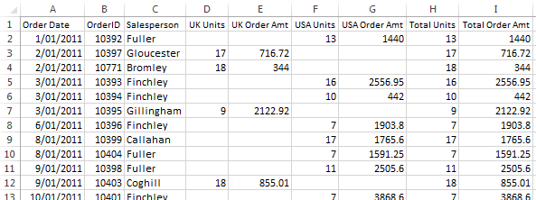

https://3months.tistory.com/292

**Pandas (Python Data Analysis Library)**


파이썬을 통해 데이터 분석을 할 때, Pandas를 빼놓고 이야기할 수 없다. 온전히 통계 분석을 위해 고안된 R 과는 다르게 python은 일반적인 프로그래밍 언어(general purpose programming language) 이며, 데이터 분석을 하기 위해서는 여러가지 라이브러리를 사용할 수 밖에 없다. 이 패키지들 중 R의 dataframe 데이터 타입을 참고하여 만든 것이 바로 pandas dataframe이다. pandas는 dataframe을 주로 다루기 위한 라이브러리이며, dataframe을 자유롭게 가공하는 것은 데이터 과학자들에게 중요하다. 물론 pandas의 문법을 외우지 않고, 필요할 때마다 책이나 웹에서 찾아가면서 해도 좋지만 자주 사용하는 조작법을 외운다면 안 그래도 귀찮은 데이터 핸들링 작업을 빠르게 할 수 있다.


그래서 본 포스팅에서는 pandas dataframe을 다루는 법을 간단하게 정리해보고자 한다. 

본 포스팅은 이 [튜토리얼](https://www.datacamp.com/community/tutorials/pandas-tutorial-dataframe-python)을 참고하였다. 





**Tabular Data type**


Pandas Dataframe은 테이블 형식의 데이터 (tabular, rectangular grid 등으로 불림)를 다룰 때 사용한다. pandas dataframe의 3요소는 컬럼, 데이터(로우), 인덱스가 있다. 그리고 파이썬의 기본 데이터 타입으로 **list**, **tuple**, **dictionary**가 있다는 것도 다시 한 번 떠올리고 바로 튜토리얼을 해보자. 본 튜토리얼은 **jupyter notebook**, **python3** 환경에서 작성되었다.

**
**

**1. Pandas Dataframe 만들기**


pandas dataframe은 다양한 데이터 타입으로부터 만들 수 있다. ndarray, dictionary, dataframe, series, list의 예를 들고 있다.(IPython의 display 함수는 IPython 쉘 환경에서 pandas dataframe을 테이블 형식으로 표현해준다.)


```python
# 1. Create Pandas Dataframe
from IPython.display import display

# Take a 2D array as input to your DataFrame 
# 이차원 배열로 만들기
my_2darray = np.array([[1, 2, 3], [4, 5, 6]])
display(pd.DataFrame(my_2darray))

# Take a dictionary as input to your DataFrame 
my_dict = {"a": ['1', '3'], "b": ['1', '2'], "c": ['2', '4']}
display(pd.DataFrame(my_dict))

# Take a DataFrame as input to your DataFrame 
my_df = pd.DataFrame(data=[4,5,6,7], index=range(0,4), columns=['A'])
display(pd.DataFrame(my_df))

# Take a Series as input to your DataFrame
my_series = pd.Series({"United Kingdom":"London", "India":"New Delhi", "United States":"Washington", "Belgium":"Brussels"})
display(pd.DataFrame(my_series))
```

|      | 0    | 1    | 2    |
| :--- | :--- | :--- | :--- |
| 0    | 1    | 2    | 3    |
| 1    | 4    | 5    | 6    |

|      | a    | b    | c    |
| :--- | :--- | :--- | :--- |
| 0    | 1    | 1    | 2    |
| 1    | 3    | 2    | 4    |

|      | A    |
| :--- | :--- |
| 0    | 4    |
| 1    | 5    |
| 2    | 6    |
| 3    | 7    |

| Belgium        | Brussels   |
| :------------- | ---------- |
| India          | New Delhi  |
| United Kingdom | London     |
| United States  | Washington |


Series의 경우 pandas에서 제공하는 데이터타입인데, index가 있는 1차원 배열이라고 생각하면 좋다. 문자, 논리형, 숫자 모든 데이터타입이 들어갈 수 있다. dataframe의 한 컬럼, 한 컬럼이 series이다.


**Dataframe 간단하게 살펴보기**


df.shape를 통해 dataframe의 row와 column 수를 알 수 있다. .index를 통해 index를 알 수 있으며, len을 통해 dataframe의 길이(row의 갯수)를 알 수 있다.


```python
df = pd.DataFrame(np.array([[1, 2, 3], [4, 5, 6]]))

# Use the `shape` property
print(df.shape)

# Or use the `len()` function with the `index` property
#row의 갯수
print(len(df.index))
```


```
(2, 3)
2
```


```
list(df.columns)
```


```
[0, 1, 2]
```


**
**

**2. Dataframe에서 특정 컬럼이나 로우(인덱스) 선택하기**


실무적으로 가장 많이 사용되는 부분중 하나는 바로 Dataframe에서 특정 컬럼이나 로우를 선택하여 그 값을 보는 것이다. pandas에서는 상당히 다양한 방법들이 있다. 대표적으로 iloc, loc, ix 등을 통해서 할 수 있다. 필자는 column을 조회할때 df['column'], row를 조회할 때는 df.ix[index]를 많이 사용한다. 가장 짧고 기억하기 쉽다.


우선 파이썬 기본 데이터 타입인 **dictionary** 데이터 타입을 통해 dataframe을 만든다. 


```
df = pd.DataFrame({"A":[1,4,7], "B":[2,5,8], "C":[3,6,9]})
```


```
# Use `iloc[]` to select a row
display(df.iloc[0])
display(df.loc[0])
display(df.ix[0])

# Use `loc[]` to select a column
display(df.loc[:,'A'])
display(df['A'])

# 특정 row, column을 선택하기
display(df.ix[0]['A'])
display(df.loc[0]['B'])
```


```
A    1
B    2
C    3
Name: 0, dtype: int64
A    1
B    2
C    3
Name: 0, dtype: int64
A    1
B    2
C    3
Name: 0, dtype: int64
0    1
1    4
2    7
Name: A, dtype: int64
0    1
1    4
2    7
Name: A, dtype: int64
1
2

```

**3. Dataframe에 컬럼, 로우, 인덱스 추가하기**


2에서는 Dataframe의 특정 컬럼, 로우에 접근하는 방법을 알아보았고, 이제 데이터를 추가하거나 수정, 삭제하는 실제 작업 방법을 알아보자.

**
**

**인덱스 설정하기**


pandas는 기본적으로 row에 인덱스를 0부터 차례대로 자연수를 부여한다. 이를 변경하는 방법은 set_index 함수를 이용하는 것이다. 아래의 df.set_index('A')는 A 컬럼을 인덱스로 지정하는 것을 뜻한다. 그러면 3개의 row에 대하여 인덱스가 1,4,7이 부여된다. 


```
# Print out your DataFrame `df` to check it out
df = pd.DataFrame({"A":[1,4,7], "B":[2,5,8], "C":[3,6,9]})
display(df)

# Set 'C' as the index of your DataFrame
df = df.set_index('A')
display(df)
```


|      | A    | B    | C    |
| :--- | :--- | :--- | :--- |
| 0    | 1    | 2    | 3    |
| 1    | 4    | 5    | 6    |
| 2    | 7    | 8    | 9    |

|      | B    | C    |
| :--- | :--- | :--- |
| A    |      |      |
| 1    | 2    | 3    |
| 4    | 5    | 6    |
| 7    | 8    | 9    |

**
**

**인덱스 접근하기 (ix와 iloc의 차이점)**

인덱스를 접근하는 방법에 여러가지가 있다. ix, loc, iloc 등을 쓸 수 있다. 필자는 ix를 주로 쓴다. ix와 iloc의 차이점은 iloc은 인덱스와 상관 없이 순서를 보고 row를 불러온다. 아래 코드에서 ix[7]은 index가 7인 로우를 불러오는 것이며, iloc[1]은 1번째 로우를 불러오는 것이다. (0번째 로우부터 시작) 근데 ix의 경우 주의할점은 index가 integer로만 이루어진 경우에는 index로 접근하지만, index에 문자가 껴있으면 순서로 접근한다는 점이다. 

```
print(df.ix[7])
print(df.iloc[1])

B    8
C    9
Name: 7, dtype: int64
B    5
C    6
Name: 4, dtype: int64
```


예를 들어, 아래 코드를 보면, 인덱스를 문자와 숫자가 혼합된 형태로 주었다. 이 때 ix[2]로 로우를 부르면 인덱스가 아니라 순서로 로우를 불러오게된다. 


```
df = pd.DataFrame(data=np.array([[1, 2, 3], [4, 5, 6], [7, 8, 9]]), index= [2, 'A', 4], columns=[48, 49, 50])

display(df)
# Pass `2` to `loc`
print(df.loc[2])

# Pass `2` to `iloc`
print(df.iloc[2])

# Pass `2` to `ix`
print(df.ix[2])
```


|      | 48   | 49   | 50   |
| :--- | :--- | :--- | :--- |
| 2    | 1    | 2    | 3    |
| A    | 4    | 5    | 6    |
| 4    | 7    | 8    | 9    |

```
48    1
49    2
50    3
Name: 2, dtype: int64
48    7
49    8
50    9
Name: 4, dtype: int64
48    7
49    8
50    9
Name: 4, dtype: int64
```


**로우 추가하기**


ix의 경우 df.ix[2]를 입력하면 index=2인 곳의 row를 교체한다. 만약 index=2인 row가 없다면 position=2에 row를 추가하게 된다. loc을 사용하면 새로운 index=2인 row를 만들고, 그 곳에 row를 추가하게 된다. 


```
df = pd.DataFrame(data=np.array([[1, 2, 3], [4, 5, 6], [7, 8, 9]]), index= [2.5, 12.6, 4.8], columns=[48, 49, 50])
display(df)

# There's no index labeled `2`, so you will change the index at position `2`
df.ix[2] = [60, 50, 40]
display(df)

# This will make an index labeled `2` and add the new values
df.loc[2] = [11, 12, 13]
display(df)
```

**
**

**Append를 이용해 로우 추가하기**


때론 인덱스를 신경쓰지 않고 그냥 데이터의 가장 뒤에 row를 추가하고 싶을 수도 있다. 이 경우에는 append를 사용하면 좋다. 아래는 df 데이터프레임에 a를 추가하여 row를 추가하는 코드를 보여준다. row를 추가한 후에 reset index를 통해 index를 0부터 새롭게 지정한다. 이는 실제 작업할 때 많이 쓰는 테크닉이다. 


```
df = pd.DataFrame(data=np.array([[1, 2, 3], [4, 5, 6], [7, 8, 9]]), columns=[48, 49, 50])
display(df)

a = pd.DataFrame(data=[[1,2,3]], columns=[48,49,50])
display(a)

df = df.append(a)
df = df.reset_index(drop=True)
display(df)
```


|      | 48   | 49   | 50   |
| :--- | :--- | :--- | :--- |
| 0    | 1    | 2    | 3    |
| 1    | 4    | 5    | 6    |
| 2    | 7    | 8    | 9    |

|      | 48   | 49   | 50   |
| :--- | :--- | :--- | :--- |
| 0    | 1    | 2    | 3    |


|      | 48   | 49   | 50   |
| :--- | :--- | :--- | :--- |
| 0    | 1    | 2    | 3    |
| 1    | 4    | 5    | 6    |
| 2    | 7    | 8    | 9    |
| 3    | 1    | 2    | 3    |


**
**

**컬럼 추가하기**


컬럼을 추가하는 방법도 여러가지가 있다. 아래는 loc을 통해 추가하거나, df['column']을 통해 추가하는 방법이다.


```
df = pd.DataFrame(data=np.array([[1, 2, 3], [4, 5, 6], [7, 8, 9]]), columns=['A', 'B', 'C'])

# Study the DataFrame `df`
display(df)

# Append a column to `df`
df.loc[:, 'D'] = pd.Series(['5', '6', '7'], index=df.index)

# Print out `df` again to see the changes
display(df)

df['E'] = pd.Series(['5', '6', '7'], index=df.index)
display(df)
```


|      | A    | B    | C    |
| :--- | :--- | :--- | :--- |
| 0    | 1    | 2    | 3    |
| 1    | 4    | 5    | 6    |
| 2    | 7    | 8    | 9    |


|      | A    | B    | C    | D    |
| :--- | :--- | :--- | :--- | :--- |
| 0    | 1    | 2    | 3    | 5    |
| 1    | 4    | 5    | 6    | 6    |
| 2    | 7    | 8    | 9    | 7    |


|      | A    | B    | C    | D    | E    |
| :--- | :--- | :--- | :--- | :--- | :--- |
| 0    | 1    | 2    | 3    | 5    | 5    |
| 1    | 4    | 5    | 6    | 6    | 6    |
| 2    | 7    | 8    | 9    | 7    | 7    |


**
**

**4. Dataframe의 인덱스, 컬럼, 데이터 삭제하기**

**
**

**인덱스 삭제**

**
**

인덱스를 지워야할 경우는 그렇게 많지 않을 것이다. 주로 reset_index를 이용해서 index를 리셋하는 것을 많이 사용한다. 혹은 index의 이름을 삭제하고 싶다면 del df.index.name을 통해 인덱스의 이름을 삭제할 수 있다. 

**
**

**컬럼 삭제**


drop 명령어를 통해 컬럼 전체를 삭제할 수 있다. axis=1은 컬럼을 뜻한다. axis=0인 경우, 로우를 삭제하며 이것이 디폴트이다. inplace의 경우 drop한 후의 데이터프레임으로 기존 데이터프레임을 대체하겠다는 뜻이다. 즉, 아래의 inplace=True는 df = df.drop('A', axis=1)과 같다.


```
df = pd.DataFrame(data=np.array([[1, 2, 3], [4, 5, 6], [7, 8, 9]]), columns=['A', 'B', 'C'])
display(df)

# Drop the column with label 'A'              
# drop axis의 경우 column이면 1, row이면 0이다.
df.drop('A', axis=1, inplace=True)
display(df)
```


|      | A    | B    | C    |
| :--- | :--- | :--- | :--- |
| 0    | 1    | 2    | 3    |
| 1    | 4    | 5    | 6    |
| 2    | 7    | 8    | 9    |

|      | B    | C    |
| :--- | :--- | :--- |
| 0    | 2    | 3    |
| 1    | 5    | 6    |
| 2    | 8    | 9    |


**로우 삭제**

**
**

**- 중복 로우 삭제**


drop_duplicate를 사용하면 특정 컬럼의 값이 중복된 로우를 제거할 수 있다. keep 키워드를 통해 중복된 것들 중 어떤 걸 킵할지 정할 수 있다.

**
**

```
df = pd.DataFrame(data=np.array([[1, 2, 3], [4, 5, 6], [7, 8, 9], [40, 50, 60], [23, 35, 37]]), 
                  index= [2.5, 12.6, 4.8, 4.8, 2.5], 
                  columns=[48, 49, 50])

display(df)

df = df.reset_index()
display(df)

df = df.drop_duplicates(subset='index', keep='last').set_index('index')
display(df)
```

**
**

**
**

|      | 48   | 49   | 50   |
| :--- | :--- | :--- | :--- |
| 2.5  | 1    | 2    | 3    |
| 12.6 | 4    | 5    | 6    |
| 4.8  | 7    | 8    | 9    |
| 4.8  | 40   | 50   | 60   |
| 2.5  | 23   | 35   | 37   |


|      | index | 48   | 49   | 50   |
| :--- | :---- | :--- | :--- | :--- |
| 0    | 2.5   | 1    | 2    | 3    |
| 1    | 12.6  | 4    | 5    | 6    |
| 2    | 4.8   | 7    | 8    | 9    |
| 3    | 4.8   | 40   | 50   | 60   |
| 4    | 2.5   | 23   | 35   | 37   |


|       | 48   | 49   | 50   |
| :---- | :--- | :--- | :--- |
| index |      |      |      |
| 12.6  | 4    | 5    | 6    |
| 4.8   | 40   | 50   | 60   |
| 2.5   | 23   | 35   | 37   |


**
**

**- 인덱스를 통한 로우 삭제**


drop 명령어를 통해 특정 index를 가진 row를 삭제할 수 있다. df.index[1] 명령어는 1번 째 위치에 있는 index를 가져온다. 가져온 이 index를 drop에 인풋으로 넣어주면 해당 index를 가진 row를 삭제할 수 있다.


```
# Check out your DataFrame `df`
df = pd.DataFrame(data=np.array([[1, 2, 3], [1, 5, 6], [7, 8, 9]]), columns=['A', 'B', 'C'])
display(df)

# Drop the index at position 1
print(df.index[1])
print(df.drop(df.index[1]))
print(df.drop(0))
```


|      | A    | B    | C    |
| :--- | :--- | :--- | :--- |
| 0    | 1    | 2    | 3    |
| 1    | 1    | 5    | 6    |
| 2    | 7    | 8    | 9    |

```

   A  B  C
0  1  2  3
2  7  8  9
   A  B  C
1  1  5  6
2  7  8  9
```

**데이터 수정하기**


특정 컬럼, 로우의 데이터를 수정하고 싶으면 ix 를 이용하면 편하다. 아래 코드는 인덱스=0, 컬럼=A의 데이터를 0으로 수정한다. 


```
df = pd.DataFrame(data=np.array([[1, 2, 3], [1, 5, 6], [7, 8, 9]]), columns=['A', 'B', 'C'])
display(df)

df.ix[0]['A'] = 0
display(df)
```


|      | A    | B    | C    |
| :--- | :--- | :--- | :--- |
| 0    | 1    | 2    | 3    |
| 1    | 1    | 5    | 6    |
| 2    | 7    | 8    | 9    |

|      | A    | B    | C    |
| :--- | :--- | :--- | :--- |
| 0    | 0    | 2    | 3    |
| 1    | 1    | 5    | 6    |
| 2    | 7    | 8    | 9    |


